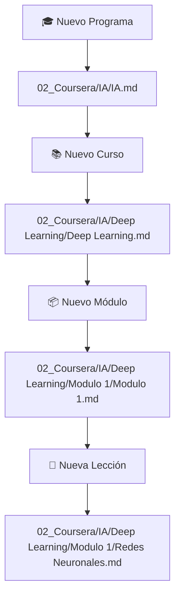

# Walkthrough del flujo definitivo

Este walkthrough resume el flujo definitivo para organizar programas, cursos,
módulos y lecciones de Coursera dentro del vault. Las carpetas se crean
automáticamente, las notas se mueven a la ruta correcta, y los desplegables
limitan las opciones a relaciones válidas. Para el detalle técnico, revisa
[[06_Sistema/Guia_Flujo_Trabajo|Guía de flujo de trabajo]].

> [!success]
> Todo el flujo parte de botones de Obsidian. No necesitas arrastrar archivos
> manualmente ni corregir rutas a mano.

## Flujo paso a paso

Este es el recorrido completo, desde el programa hasta la lección final.

1. **Crear programa** con `🎓 Nuevo Programa Coursera`.
   Escribes el nombre del programa y el sistema crea la carpeta base con su
   archivo índice.
   Ejemplo: `02_Coursera/IA/IA.md`.
2. **Crear curso** con `📚 Nuevo Curso Coursera`.
   Escribes el nombre del curso y seleccionas el programa desde una lista de
   programas existentes. El sistema crea la carpeta del curso y mueve la nota
   a su ubicación final.
   Ejemplo: `02_Coursera/IA/Deep Learning/Deep Learning.md`.
3. **Crear módulo** con `📦 Nuevo Módulo Coursera`.
   Escribes el nombre del módulo y seleccionas el curso al que pertenece. El
   sistema encuentra la carpeta del curso y crea ahí la subcarpeta del módulo.
   Ejemplo:
   `02_Coursera/IA/Deep Learning/Modulo 1/Modulo 1.md`.
4. **Crear lección** con `📝 Nueva Lección Coursera`.
   Escribes el título de la lección, eliges primero el curso y luego solo los
   módulos de ese curso. La nota se mueve directamente a la carpeta del
   módulo.
   Ejemplo:
   `02_Coursera/IA/Deep Learning/Modulo 1/Redes Neuronales.md`.

## Vista rápida

Esta vista resume cómo encaja cada paso dentro de la estructura final.

## Beneficios clave

Este flujo evita trabajo manual y mantiene las relaciones entre notas
consistentes desde el inicio.

- **Adiós al caos:** no tienes que arrastrar archivos con el mouse porque el
  sistema los mueve automáticamente.
- **Integridad de datos:** los menús desplegables te obligan a elegir nombres
  correctos y existentes.
- **Relaciones automáticas:** las tablas de progreso se completan solas porque
  cada nota guarda su programa, curso o módulo padre.

## Prueba recomendada

La forma más simple de validar el sistema es ejecutar el flujo completo una
vez.

1. Crea un programa.
2. Crea un curso dentro de ese programa.
3. Crea un módulo dentro de ese curso.
4. Crea una lección dentro de ese módulo.

Cuando termines, el panel lateral de Obsidian debería mostrar la estructura
ordenada sin mover nada manualmente.
